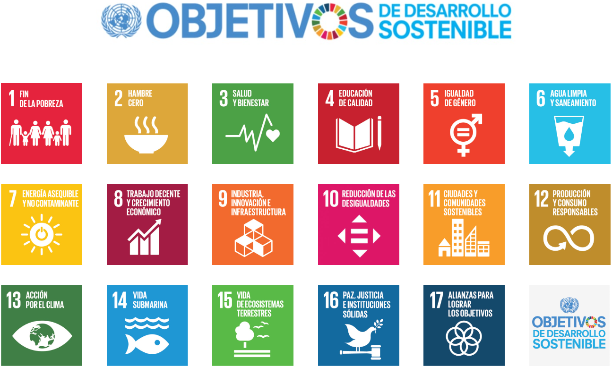

# Indicadores, objetivos y sustentabilidad en México

En esta Lección conoceremos sobre los conceptos básicos de la sustentabilidad, las diferentes formas de medirla, sus objetivos y metas a nivel global y nacional y la situación de la sustentabilidad en México.

Los **indicadores de desarrollo sustentable** son medidas cuantitativas o cualitativas que **se utilizan para evaluar el progreso** o el desempeño general de una región, país, organización o comunidad en el logro de los **objetivos de desarrollo sustentable**.

Estos indicadores ayudan a monitorear y evaluar diversas dimensiones de la sustentabilidad, como los aspectos económicos, sociales y ambientales.

## Objetivos y metas del desarrollo sustentable

Ahora que has conocido los indicadores del desarrollo sustentable, vayamos a conocer los objetivos y metas.

### Objetivos del desarrollo sustentable

De acuerdo con Walker et al (2019), los Objetivos de Desarrollo Sustentable (ODS) son un conjunto de 17 objetivos globales que fueron adoptados por la Asamblea General de las Naciones Unidas en 2015. Los ODS se basan en los Objetivos de Desarrollo del Milenio (ODM), que se establecieron en el 2000 y se lograron en gran medida en 2015.

### Dimensiones del desarrollo sustentable

1. Reducir la pobreza y abordar las desigualdades en ingresos, educación y atención sanitaria.
1. Garantizar el acceso a servicios básicos como agua potable, saneamiento, atención sanitaria y educación.
1. Promoción de la igualdad de género y el empoderamiento de las comunidades marginadas.
1. Crear oportunidades de trabajo y medios de vida decentes.

### Metas del desarrollo sustentable

Los ODS están divididos en 169 metas, que proporcionan un marco para la acción global. Las metas son específicas, medibles, alcanzables, relevantes, limitadas en el tiempo y orientadas a resultados.
[Metas del ODS](https://www.mdsocialesa2030.gob.es/agenda2030/documentos/metas-ods.pdf).

---
Los ODS son un llamamiento a la acción para todos los países, ricos y pobres. Todos los países tienen un papel que desempeñar en la consecución de los ODS.

Los ODS son importantes porque proporcionan un marco para la acción global para lograr un futuro sustentable; son ambiciosos, pero son alcanzables si todos trabajamos juntos.

### 17 Objetivos del Desarrollo Sustentable

1. Poner fin a la pobreza en todas sus formas y en todo el mundo.
2. Poner fin al hambre, lograr la seguridad alimentaria y la mejora de la nutrición, y promover la agricultura sustentable.
3. Garantizar una vida sana y promover el bienestar de todos a todas las edades.
4. Garantizar una educación inclusiva y equitativa de calidad y promover oportunidades de aprendizaje permanente para todos.
5. Lograr la igualdad de género y empoderar a todas las mujeres y las niñas.
6. Garantizar la disponibilidad y la gestión sostenible del agua y el saneamiento para todos.
7. Garantizar el acceso a una energía asequible, fiable, sostenible y moderna para todos.
8. Promover el crecimiento económico sostenido, inclusivo y sustentable, el empleo pleno y productivo y el trabajo decente para todos.
9. Construir infraestructuras resilientes, promover la industrialización inclusiva y sustentable y fomentar la innovación.
10. Reducir la desigualdad en los países y entre ellos.
11. Lograr que las ciudades y los asentamientos humanos sean inclusivos, seguros, resilientes y sustentables.
12. Garantizar modalidades de consumo y producción sustentables.
13. Adoptar medidas urgentes para combatir el cambio climático y sus efectos.
14. Conservar y utilizar sustentablemente los océanos, los mares y los recursos marinos para el desarrollo sustentable.
15. Proteger, restablecer y promover el uso sustentable de los ecosistemas terrestres, gestionar sustentablemente los bosques, luchar contra la desertificación, detener e invertir la degradación de las tierras y detener la pérdida de biodiversidad.
16. Promover sociedades pacíficas e inclusivas para el desarrollo sustentable, facilitar el acceso a la justicia para todos y construir a todos los niveles instituciones eficaces e inclusivas que rindan cuentas.
17. Fortalecer los medios de implementación y revitalizar la Alianza Mundial para el Desarrollo Sostenible.

Para obtener el listado completo de las 169 metas incluidas en los 17 objetivos, analiza la información del siguiente enlace:

Autor: INEGI
Título: [Objetivos de Desarrollo Sostenible](https://agenda2030.mx/ODSopc.html?ti=T&goal=0&lang=es#/ind)

## Objetivos de Desarrollo Sostenible (Perspectiva Más Amplia)

En un sentido más amplio, las **metas** del **desarrollo sustentable** abarcan los **objetivos** y **principios generales** que guían los esfuerzos para lograr la sustentabilidad. Estos objetivos a menudo no son específicos ni cuantificables como los **ODS**, pero proporcionan un marco para pensar en la **sustentabilidad**.

### Conservación ambiental

Proteger y preservar el entorno natural, incluyendo la biodiversidad, los ecosistemas y los recursos naturales, para asegurar su disponibilidad para las generaciones futuras.

### Prosperidad económica

Promover el crecimiento económico y el desarrollo que sea inclusivo, equitativo y ambientalmente responsable, fomentando oportunidades económicas para todos.

### Equidad social

Garantizar que los beneficios del desarrollo se compartan equitativamente entre todos los miembros de la sociedad, abordando cuestiones de pobreza, desigualdad y justicia social.

### Consideraciones culturales y éticas

Reconocer y respetar la diversidad cultural, las tradiciones y los valores éticos en el contexto de las actividades de desarrollo.

### Equidad intergeneracional

Satisfacer las necesidades del presente sin comprometer la capacidad de las generaciones futuras para satisfacer sus propias necesidades.

### Cooperación global

Promoción de la cooperación y asociaciones internacionales para abordar desafíos globales como el cambio climático, la pobreza y la desigualdad.

### Gobernanza responsable

Fomentar la buena gobernanza, la transparencia y la rendición de cuentas en todos los niveles de la sociedad y el gobierno.

Estos objetivos más amplios proporcionan un **marco rector** para que los formuladores de políticas, las organizaciones y las comunidades **trabajen** hacia un **futuro más sustentable y resiliente**, reconociendo al mismo tiempo la interconexión de los aspectos económicos, sociales y ambientales del desarrollo. Los **ODS** mencionados anteriormente son un ejemplo concreto de **esfuerzos globales** para traducir estos objetivos más amplios en metas y acciones específicas.

## Ejercicio resuelto

- ¿Qué pretenden lograr los objetivos y metas del desarollo sostenible?
  - Equilibrar los objetivos económicos, sociales y ambientales para el bienestar a largo plazo.
- ¿Cuál es la importancia de los indicadores sociales en el desarrollo sustentable?
  - Proporcionan información sobre la calidad de vida, la equidad y la inclusión dentro de una sociedad.
- ¿Cuál es el enfoque principal de los objetivos de desarrollo sustentable (ODS)?
  - Abordar los desafíos globales salvaguardando el planeta y
mejorando la vida de las personas.
- ¿Cuál es una acción significativa de desarrollo sustentable
que México ha emprendido?
  - Lanzar el programa "Sembrando Vida" para promover el
desarrollo rural y agroforestal.
- ¿Cuál es el propósito principal de utilizar indicadores de
sustentabilidad?
  - Seguir y evaluar los avances hacia una sociedad equilibrada y sostenible.
