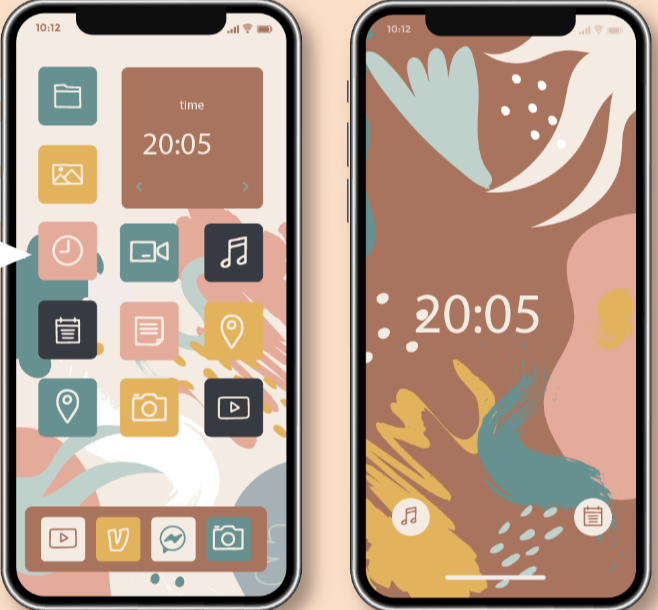

# Diseño de los componentes de la interfaz

Reflexiona…

Puedes reconocer los componentes que integran el diseño de una interfaz basándote en los criterios de funcionalidad.

Realizar un **diseño de interfaz de usuario** permite definir la forma en la que se mostrarán los aspectos de **apariencia externa del sistema**.

Al utilizar la aplicación informática el usuario deberá familiarizarse con su diseño, por lo que es importante considerar aspectos como:

- Facilidad de uso.
- Instrucciones accesibles.
- Simplicidad y claridad en los textos.
- Botones.

**Concepto Clave**
Podemos definir la **interfaz de usuario** como aquel espacio de interacción **entre** el **sistema** y el **ser humano**.

Un **sistema informático** está conformado por *software* y hardware. En este caso, los diferentes **dispositivos de hardware** servirán como extensión del sistema de cómputo para interactuar con el usuario.

El usuario recibe información por medio de su vista, oído y tacto, tanto del *software* como del hardware.

---
El **hardware** se relaciona con las funciones de **entrada** y **salida** del sistema. La ingeniera o ingeniero de *software* deberá considerar un flujo **bidireccional de datos**, pues esto les permitirá planear las salidas y entradas de los mismos a la aplicación informática.

- Input / entrada. Una interfaz gráfica de usuario presenta visualmente la información y al mismo tiempo puede recibir en forma táctil pulsos de interacción del usuario.
- Output / salida. Una interfaz gráfica de usuario puede tener ambas funcionalidades, tanto mostrar como recibir información. Un ejemplo de hardware que exclusivamente genera información de salida son las bocinas de un sistema informático.

## Diseñar una interfaz de usuario es una labor que implica

- Crear pantallas.
- Generar imágenes.
- Especificar los menús.
- Colocar íconos.
- Escribir instrucciones claras.

En general construir la forma en la que el usuario interactuará con el sistema informático.

---
El diseño de los componentes de la interfaz abarca **reconocer los elementos que integran a salida y entrada de información** hacia y desde un sistema de *software*.

La interfaz debe considerar la **forma** que tendrá el sistema informático, su **utilidad**, así como su **imagen**. Aspectos que definirán las **características del sistema** en sí mismo.

Los aspectos de **apariencia externa** del sistema informático son sumamente importantes.

---
La funcionalidad del sistema debe considerarse al momento del diseño de la interfaz, así como la experiencia que tenga el usuario.

Aspectos a tener en cuenta en el **diseño de interfaz** para una **experiencia** de usuario accediendo al sistema:

- Imagen.
- Practicidad de uso.
- Usabilidad.
- Ergonomía.
- Adaptabilidad.
- Apariencia estética.
- Facilidad.

## ¿Qué es el diseño de componentes?

Se refiere a los menús, íconos, imágenes, instrucciones y en general todos los elementos que integran una aplicación informática y que tienen que ser construidos para interactuar con el usuario, por ejemplo: un botón color rojo con la función de apagado en un teléfono celular.

Elementos a tomar en cuenta para el diseño de componentes:

- Un diseño adecuado de la interfaz de usuario logra que las actividades que se realizan en el sistema alcancen una **interacción** adecuada.
- La importancia de la apariencia en el diseño deberá permitir un **equilibrio de funcionalidad técnica y de los elementos visuales**.

---
El diseño de interfaz **no solo considera la funcionalidad, sino la actividad que se va a desarrollar por parte del usuario cuando este accede al sistema.**

Recursos como los gráficos son los símbolos que, sin afectar el funcionamiento técnico, deberán comunicar la interacción del sistema.

**Importante**
Comprender la necesidad del usuario, no perder la funcionalidad y cumplir los objetivos del proyecto de *software*.

---
**Ejemplo**
En la interfaz de un teléfono celular se debe tener en cuenta:

- Funcionalidad y facilidad de uso.

- En este dispositivo se muestran íconos de acceso rápido en la pantalla principal para que el usuario pueda cambiar la configuración.
<!--  -->

## Fases y procesos en el diseño de interfaz de usuario

1. **Análisis preliminar**. Son las **primeras acciones** por parte del desarrollador de *software* **para conocer el entorno** donde se construye el sistema informático, por ejemplo: nombre del proyecto de *software*, nombre de las personas interesadas y problemática a resolver son el sistema informático.
2. **Diseño de los componentes**. Actividad cuyo objetivo es **documentar una primera idea del sistema informático** que se va a construir. El modelo puede elaborarse a través de un diagrama de flujo.
3. **Modelo o bosquejo visual**. Es el **documento que especifica las partes** que compondrán el sistema informático, por ejemplo: menús, botones, pantalla de inicio, mensajes de errores, entre otros.

Preguntas orientadoras para el diseño de componentes de interfaz:

1. ¿Qué necesita ver el usuario en la interfaz con el sistema?
2. ¿La interfaz gráfica del sistema resulta acorde con el flujo de datos?
3. ¿El usuario comprende el significado de los símbolos que se utilizan en la interfaz del sistema?
4. ¿Estéticamente el sistema responde a las necesidades de comportamiento y facilidad de uso, sin comprometer la funcionalidad?

---

Los **conceptos y elementos básicos** a tomar en cuenta para **definir los componentes** que facilitan el uso de la interfaz del sistema por parte del usuario pueden definirse desde la fase del análisis y serán integrados al diseño final conforme se avance en el desarrollo del proyecto de *software*.

Considerando el estándar ISO 9241 se establecen ciertos principios que pueden ser considerados al momento de integrar los diferentes componentes que integran el diseño de interfaz, entre ellos los siguientes:

### Estándar ISO 9241

1. **Adecuación de la tarea**: Los diálogos que muestre el sistema deberán ser **congruentes y claros** con respecto a la actividad que realizará el usuario.
2. Los **cuadros de diálogo** que permiten la interacción del sistema-persona serán **comprensibles**.
3. El diseño buscará cumplir con la **expectativa del usuario**, en cuanto a **experiencia y sensaciones**.
4. El usuario deberá ser capaz de **controlar el flujo y ritmo de interacción**.
5. La interacción persona-sistema deberá ser **tolerante a fallas o errores**, es decir, en caso de un ingreso erróneo de datos por parte del usuario, el sistema deberá ser capaz de tolerar posibles fallas.
6. El **sistema y sus componentes podrán ser configurables**, siempre que no comprometan la funcionalidad del sistema.

### Los atributos a considerar durante el diseño de componentes de interfaz son los siguientes

- **Claridad**. No sobrecargar de información al usuario.
- **Consistencia**. Diseño que alcance las expectativas del usuario, consideradas desde la planeación inicial, tomando en cuenta las pruebas piloto y los prototipos construidos durante el proceso.
- **Detectable**. La información mostrada al usuario deberá permitirle dirigir su atención hacia donde sea necesario.
- **Legible**. La información que los componentes muestren en la interfaz serán de fácil acceso a la lectura y comprensión, incluyendo el uso de símbolos, íconos e imágenes de referencia.
- **Comprensibilidad**. Tener claridad de comprensión, concordancia entre lo que se muestra y lo que el usuario podría llegar a entender.

## Ejercicios resueltos

1. En ingeniería de *software*, ¿cuál es el objetivo del proceso de diseño de componentes de interfaz?
    - Reconocer los componentes que integran el diseño de una interfaz basada en los criterios de funcionalidad.

2. ¿Qué aspectos definirán las características de un sistema de acuerdo al diseño de componentes de interfaz?
    - Forma, utilidad que el *software* requiere e imagen en sí misma del sistema.

3. Los elementos a tomar en cuenta para el diseño de componentes son: practicidad de uso, ergonomía, imagen, facilidad, apariencia estética, usabilidad y adaptabilidad.
    - Verdadero.

4. Un diseño adecuado de la interfaz de usuario logra que las actividades que se realizan en el sistema alcancen una interacción adecuada.
    - Verdadero.

5. Las fases en el diseño de interfaz de usuario son: análisis preliminar, modelo o bosquejo visual y diseño de los componentes.
    - Verdadero.
