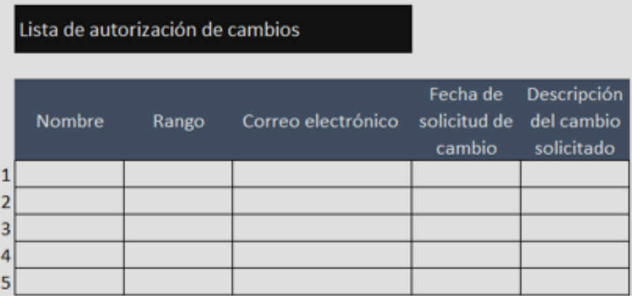
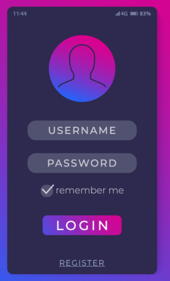
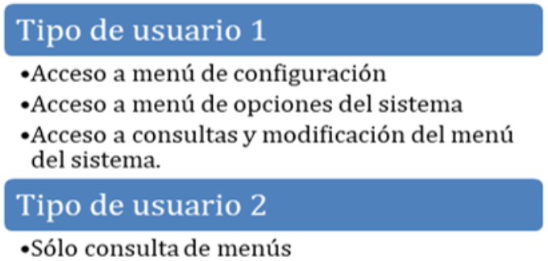
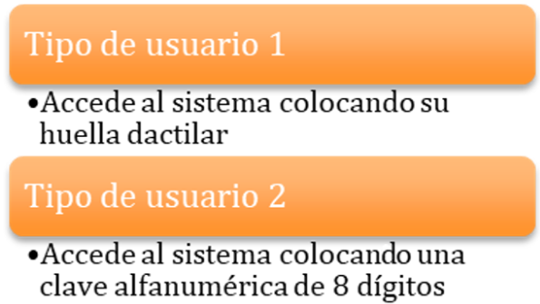
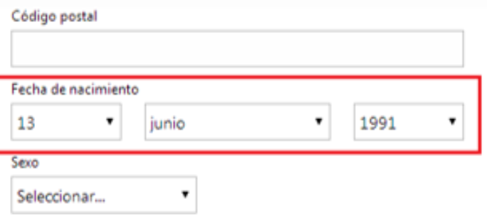
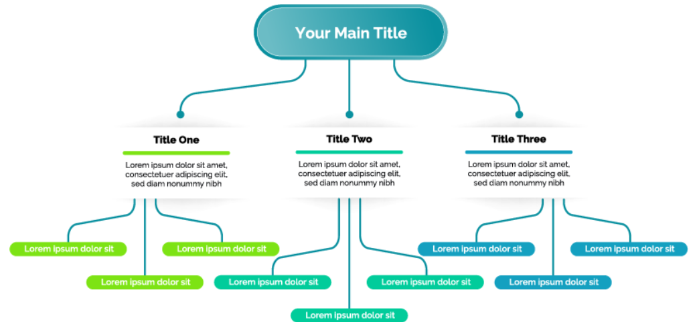
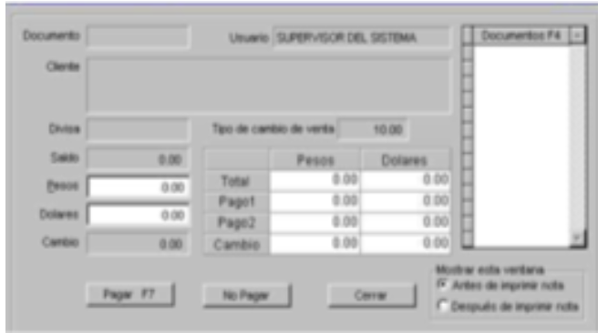

# Etapas del diseño de la interfaz

## Presentación y Motivación Inicial

Gabriel:
Hola, buenos días. No te veía desde que comenzamos a trabajar juntos en este nuevo proyecto de *software*. Estoy motivado en esta parte del diseño de sistema, pues finalmente trabajaremos con las interfaces del usuario.

Julieta:
Hola, sí, hace tiempo que no nos vemos. Supe que colaboraría contigo cuando empezamos el proyecto, me parece muy interesante.

## Compromiso y Asignación de Tareas

Gabriel:
Ahora más que nunca estamos comprometidos a crear productos de calidad. Al inicio de este nuevo proyecto, asignamos tareas a nuestros compañeros para dar un seguimiento puntual de los entregables. Por cierto, ¿en qué actividades estás participando?

Julieta:
Estoy participando en el **diseño de la interfaz**.

Gabriel:
¡Qué interesante! Yo estoy trabajando en la **documentación** y la **guía de usuario**.

## Proceso de Diseño de la Interfaz de Usuario

Gabriel:
¿Cuáles son los pasos que realizas en el diseño de la interfaz?

Julieta:
Pues mira, existen diferentes actividades que un ingeniero de *software* puede realizar basándose en métodos y técnicas de ingeniería. Principalmente, el objetivo es lograr la funcionalidad del producto de *software* terminado.

Gabriel:
Pero, ¿qué haces exactamente?

Julieta:
Te platico. El diseño de interfaz **comienza por identificar los requerimientos del usuario**, nuestro cliente, que en este caso es quien indica cómo necesita que funcione el sistema que estamos desarrollando. Eso no es todo; **se crean tareas con base en la identificación de actividades** que realizará el usuario conforme interactúa con las diferentes pantallas. **Se crean y analizan diferentes escenarios**, y **se definen objetos y acciones** que el usuario realizaría con el sistema.

Gabriel:
O sea, que ustedes se imaginan cómo observará el usuario al sistema, incluyendo botones, reconocimiento de voz, colores, y dónde debe pulsar.

Julieta:
¡Exacto! Incluso realizamos una **identificación de tareas de usuario** y las registramos en un documento para comprender **cómo experimenta** el usuario la interacción con el sistema. Es importante identificar si el usuario utilizará una pantalla táctil, reconocimiento por voz, o el teclado y ratón de la computadora para realizar acciones concretas en el *software* que estamos diseñando.

## Retos de la Interfaz y Creación de Prototipos

Gabriel:
Comprendo, pero una pregunta: ¿no es imposible saber cómo piensa un usuario y cómo actuaría al utilizar el sistema informático que todavía no existe?

Julieta:
Es correcto. Por esa razón, el equipo de ingeniería de *software* responsable de analizar la interfaz de usuario, en este caso yo, tiene la responsabilidad de crear plantillas de pantallas que ilustran el **diseño gráfico** y la **colocación de los iconos**, la definición de **textos descriptivos**, la **especificación** y **títulos de las ventanas**, así como la especificación de aspectos de los diferentes menús a los que tiene acceso el usuario. Creamos prototipos, vistas de imágenes que permiten observar cómo se vería el sistema en su funcionamiento cuando ya está terminado.

- Diseño grafico.
- Colocación de íconos.
- Textos descriptivos.
- Títulos de las ventanas.

Julieta:
Es similar a construir una casa: ya tienes el diseño y ahora construyes una pequeña maqueta de manera que, antes de poner el primer muro de cemento o ladrillo, se puede observar cómo quedaría la casa que vas a construir. En el caso del diseño de interfaz, realizamos prototipos antes de construir el *software*, incluso llevamos a cabo pruebas piloto, como cuando vas a comprar un automóvil; antes de pagar por el vehículo, lo manejas primero. Por ejemplo, imagina que vas a comprar un par de zapatos; no los compras en línea porque te gustaría probarlos antes de pagar por ellos. Entonces observas detalles en el zapato y le pides al asistente de la tienda que realice ajustes al diseño. Quizás el color no te agrada o no te gustan las agujetas, y conforme le vas dando indicaciones, te muestran nuevos zapatos acordes a tu gusto sin perder la funcionalidad del calzado.

Gabriel:
Entiendo, ya me queda más claro. Pero cuando compro un par de zapatos, no los fabrican a mi gusto en ese momento.

Julieta:
¡Exacto! Esa es la importancia del desarrollador. En términos de ingeniería, **un *software* debe ser lo más preciso posible y evitar errores**. Eso es lo que llamamos ***software* de calidad**. Por ese motivo, se utilizan diferentes modelos para el diseño de la interfaz.

## Concepto y Uso de Modelos en Ingeniería de *software*

Gabriel:
Espera, espera, ¿entonces qué es un modelo?

Julieta:
Muy buena pregunta. Podemos definir un modelo como **una representación del mundo real a través de otro objeto**. Por ejemplo, si yo dibujo en una hoja de papel una serie de líneas que representan una casa, entonces estoy haciendo un modelo de una casa. En el caso de la ingeniería de *software*, los modelos permiten seguir rutas de trabajo ya establecidas con base en buenas prácticas y recomendaciones, incluso de otros países, que explican cómo realizar un producto de *software* que cumpla con su objetivo y que resulte funcional para el usuario. Por esa razón, el diseño de la interfaz es tan importante, porque es el espacio en el que interactúa la persona con el sistema informático.

Julieta:
Te daré un ejemplo. Comenzamos con el empleo de diferentes herramientas que nos permiten hacer el prototipo del sistema. Después, se implementa el modelo del diseño realizado y finalmente **evaluamos** la calidad del resultado obtenido. Para llegar a ello, pasamos por las siguientes etapas:

- el proceso,
- el análisis de la interfaz,
- el análisis del usuario,
- el análisis y modelado de la tarea,
- el análisis y contenido de la pantalla,
- las etapas del diseño de la interfaz y, por último,
- la evaluación del diseño.

Te platico en qué consiste cada una de ellas.

Julieta:
Mira, precisamente en el monitor tengo un diagrama de flujo con estas etapas. Te lo muestro.

Gabriel:
¡Qué interesante! Gracias, estoy aprendiendo mucho del diseño de la interfaz.

Julieta:
Un ingeniero o ingeniera de *software* puede seguir un proceso determinado para conocer el problema, identificarlo y proponer cómo resolverlo con un programa de computadora. Recuerda que **un proceso es una serie de pasos a seguir para alcanzar una meta**. Una posible estrategia a seguir es conocer un modelo de referencia, por ejemplo, el **Modelo de Integración de Sistemas de Modelos de Madurez de Capacidades**, o por sus siglas en inglés CMMI (Capability Maturity Model Integration). **Es un modelo para la mejora y evaluación de procesos para el desarrollo de *software*** y pertenece al CMMI Institute, con sede en los EE. UU.

Julieta:
Retomando la analogía que te comentaba, piensa en el plano de una casa.

Gabriel:
Cierto, el plano de una casa no está completo sin la representación de puertas, ventanas y las conexiones necesarias para los servicios de agua, luz y teléfono. Entonces, todos estos elementos representan los servicios del *software* informático que conforman la interfaz de usuario.

## Guías y Recursos para el Diseño de Interfaz

Gabriel:
Oye, ¿y cuando haces el diseño de interfaz lo realizas siguiendo una guía o cómo?

Julieta:
Te explico algunas de las etapas.

### Etapas del diseño de la interfaz (de enlace)

1. El proceso. Se definen las reglas y los acuerdos con los que se determinará el diseño de la interfaz. Es importante dejar claras las reglas con todos los participantes involucrados en el proyecto para evitar confusiones. Así mismo, se definen los canales de comunicación adecuados, incluidos los registros y evidencias de actividades para posteriores consultas. Por ejemplo, se puede definir en un formato de Excel, el nombre de las personas autorizadas para solicitar cambios al desarrollo del sistema. Así, es posible rastrear cualquier modificación. Como resultado de esta primera etapa obtenemos los documentos que definen las reglas.
    
2. Análisis de la interfaz. Consiste en determinar qué componentes incluyen las pantallas que observará el usuario para utilizar el sistema; desde la pantalla de acceso al login hasta los menús que incluye el sistema. Se pueden considerar tres recomendaciones: dar el control al usuario, reducir la necesidad de que el usuario memorice y ser consistentes con el diseño, es decir, la información debe estar organizada y los mecanismos de entrada y salida de datos deben ser claros. De esta etapa obtenemos las pantallas que verá el usuario.
    
    
3. Análisis del usuario. Esta etapa considera las características del usuario y sus privilegios de acceso, es decir, no todos los usuarios verán la misma información. El resultado de dicha etapa es un documento con la definición de los permisos que tiene el usuario a los diferentes menús y pantallas del sistema. Es importante determinar a cuáles datos podrán entrar y si es necesario limitar el acceso por una contraseña tradicional o biométrica.

    La biometría se refiere a medir una característica de tu cuerpo para dar acceso a cierta información. Por ejemplo, para desbloquear tu celular debes colocar el dedo índice en el sensor; pues bien, el programador o programadora del *software* determina en la interfaz que se utilizaría esta característica para realizar dicha acción.
    
    

4. Análisis y modelado de la tarea. Aquí se determinan las funcionalidades del *software*, es decir, cómo va a reaccionar dependiendo de la interacción con el usuario. También deben considerarse posibles fallas, o errores por parte del usuario y cómo reaccionaría el sistema. Por ejemplo, si el sistema solicita que el usuario escriba su fecha de nacimiento y el usuario se equivoca y coloca letras en vez de números, deberá determinarse cómo responderá el sistema a esta situación. El resultado de esta etapa es un documento con las pantallas y los posibles mensajes de error que muestra el sistema, así como los mensajes que proporcionan las instrucciones al usuario.
    

5. Análisis y contenido de la pantalla. Permite determinar los esquemas del menú. Los menús proporcionan a los usuarios una forma familiar de recuperar información y si son sencillos, mucho mejor. A los usuarios se les presenta el diseño completo del sistema a través de esquemas en forma descendente, donde se muestran las distintas opciones que el sistema tendrá y el uso de colores y texturas; todos aquellos elementos que permitan al usuario percibir cómo quedará el sistema son bienvenidos. El resultado de esta etapa es un esquema similar a un diagrama de flujo donde se identifican los módulos del sistema.
    

6. Etapas del diseño de la interfaz. En estas etapas se clasifican en un esquema los tipos de menús, el tipo de información que se podrá utilizar, la secuencia lógica de los datos que se requieren capturar en el menú, etcétera. Es importante mencionar que deben quedar claros los diferentes subsistemas que tiene el sistema para que el usuario pueda manejar cada elemento con cierta naturalidad y se eviten confusiones. Por ejemplo, la captura de datos no se maneja muy fácilmente en un menú. Al final de la etapa resulta un documento con un diagrama en orden jerárquico donde se especifican los nombres de cada menú, así como la función que tienen el sistema.
    

7. Evaluación del diseño. Se recaba la experiencia del usuario y se hacen ajustes. En esta etapa se obtiene como resultado un cuestionario o lista de cotejo, también conocida como checklist, donde se conoce la opinión del usuario con respecto a las características del sistema y los requerimientos. Es importante que el sistema satisfaga las necesidades originales planteadas y si hay cambios en el desarrollo, estos queden registrados. Con cada nuevo cambio se tiene la oportunidad de mejorar el sistema.

    La información que brinda el usuario y su experiencia con el sistema se recaba haciendo entrevistas, probando el sistema, realizando pruebas con el usuario y el sistema en diferentes escenarios y observando cómo el usuario utiliza el sistema.

---
Julieta:
No olvides que al hacer un análisis del diseño de la interfaz, siempre puedes apoyarte de diferentes modelos de trabajo. También hay modelos de referencia; puedes investigar más sobre ellos, pues permiten considerar lineamientos y herramientas para diseño de sistemas de *software*. Incluso hay certificaciones y cursos al respecto.

Gabriel:
Muy bien, muchas gracias.

Julieta:
En resumen, al hablar de modelos de diseño de la interfaz, identificamos 7 etapas:

1. El proceso.
2. Análisis de la interfaz.
3. Análisis del usuario.
4. Análisis y modelado de la tarea.
5. Análisis y contenido de la pantalla.
6. Etapas del diseño de la interfaz.
7. Evaluación del diseño.

Gabriel:
¡Excelente! Muchas gracias por la información.

## Ejercicios resueltos

1. En relación con los modelos del diseño de interfaz, basándose en métodos y técnicas, ¿cuál es el principal objetivo de un ingeniero de *software*?
    - Lograr la funcionalidad del producto de *software* terminado.
2. Dentro de las etapas para el modelo de diseño de interfaz, el análisis del usuario considera:
    - Las características del usuario y sus privilegios de acceso.
3. Crear tareas con base en la identificación de actividades que realiza el usuario, conforme interactúa con el sistema, es como se lleva a cabo el diseño de interfaz aplicando métodos y técnicas.
    - Verdadero
4. El diseño de interfaz se puede centrar en dos principales áreas: los componentes del *software* y la interfaz entre consumidores y productores de datos.
    - Falso.
5. En el área de ingeniería de *software*, algunas de las etapas para modelar el diseño de la interfaz requieren de infraestructura de última generación, de otra forma no podrá ser posible desarrollar el proyecto de *software* con calidad.
    - Falso.
