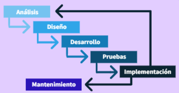
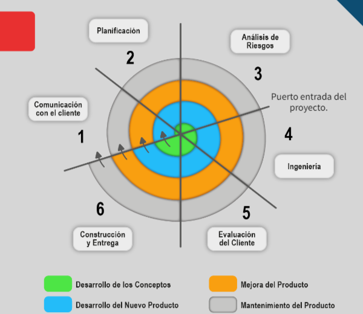

# Modelos de proceso de *software*

## ¿Qué es un modelo de desarrollo de *software*?

Es una representación abstracta que permite describir un proyecto de *software*.

- Modelo.
- Abstracción.
- Representación.

## ¿Para qué sirven los modelos de desarrollo de *software*?

Los modelos de desarrollo de *software* permiten priorizar la calidad orientada al cumplimiento de ciertos estándares, así como las normas que el proyecto requiera.

Conocer diferentes modelos de desarrollo de *software* permite optimizar los recursos disponibles, lo cual garantiza los productos y la solución a las necesidades.

El principal objetivo de integrar este conjunto de modelos es brindar herramientas que faciliten el desarrollo de *software*.

### Calidad

La calidad es un elemento fundamental para emplear un modelo de desarrollo de *software*.

De acuerdo con Pressman, la definición de la calidad en el *software* se puede entender como la “concordancia con los requisitos funcionales y de rendimiento explícitamente establecidos, con los estándares de desarrollo explícitamente documentados y con las características implícitas que se espera de todo *software* desarrollado profesionalmente” (2003, p.125).

## Modelos de desarrollo de *software*

También es posible medir la calidad después de haber elaborado un *software*. Al realizar un modelo, se hace un registro de variaciones de acuerdo con el tipo de programa, de esta manera se cuenta con parámetros de referencia del producto final al producto estimado dentro del modelo de desarrollo de *software*.

### Proceso incremental

El modelo de **desarrollo incremental** determina una serie de procesos segmentados de las partes del *software*. De esta manera cada uno de estos procesos proporciona una funcionalidad con respecto a los requisitos. Con esta segmentación se asignan prioridades y cada etapa se entrega con base a esta asignación.
En este modelo se establecen entregas parciales de acuerdo con un calendario de plazos. Conforme se avanza en el desarrollo, el producto final deberá mostrar un avance con respecto a la totalidad.

El modelo de proceso incremental puede adaptarse a las características del proyecto con relativa flexibilidad.
Se observan las siguientes etapas:

1. Requerimientos.
2. Definición de las tareas.
3. Diseño de los incrementos.
4. Desarrollo de incrementos.
5. Validación de incrementos.
6. Integración de incrementos.
7. Entrega del producto.

### Cascada

El **modelo de cascada** está conformado por un proceso secuencial, es decir, el desarrollo de *software* es planteado como un conjunto de pasos o etapas que se ejecutan de manera consecutiva.
En este modelo, una etapa del proceso inicia cuando la anterior termina.

El modelo de cascada se compone de cinco fases:

1. Requisitos del sistema. Se toma en cuenta un análisis de necesidades por parte del cliente o proveedor de requerimiento, es decir, la persona autorizada para dar información que determine las características del *software* a desarrollar. En este modelo no se deberán añadir nuevos requisitos una vez iniciado el proceso.
2. Diseño. Se describe una estructura del *software* de forma interna, así como las relaciones entre las diferentes partes. También es posible descomponer y organizar el sistema de elementos que conforman el *software* y su combinación.
3. Implementación. El *software* se instala, se configura y se pone a punto, de manera que pueda utilizarse en un entorno real, incluyendo pruebas piloto.
4. Verificación. Permite asegurar la capacidad de concordancia entre los requerimientos y el desarrollo del producto de *software*. En esta etapa el sistema es probado íntegramente.
5. Instalación y mantenimiento. Finalmente se realiza la completa funcionalidad del *software*. Durante esta etapa también pueden surgir modificaciones debido a fallas, por lo que será importante continuar con un mantenimiento del sistema desarrollado.

### Espiral

Se describe un ciclo de vida del *software*, es decir, desde la identificación del programa hasta la implementación, instalación y mantenimiento del *software*, por medio de espirales, de manera que en cada espiral se evalúa el avance, riesgo y la complejidad del desarrollo.
Este modelo puede considerarse como evolutivo y podría resultar iterativo (es de decir por etapas) al construir prototipos y revisar de forma constante el avance.

### Desarrollo concurrente

El modelo de **desarrollo concurrente** genera una serie de acontecimientos que inician puntos de transición o “arranque” de manera que el modelo de análisis permite comenzar con el trabajo de desarrollo en cuanto se tiene el listado de requerimientos.

Puede aplicarse de dos maneras:

- Las actividades y los componentes ocurren de forma simultanea.
- Las acciones y los componentes planeados en el modelo se pueden implementar con componentes adicionales.

Algunas de las ventajas del modelo concurrente son:

- Recomendable para proyectos de desarrollo de *software* en los que se conforman diferentes grupos de trabajo.
- Se pueden iniciar actividades paralelamente, pues no dependen una de otra.

### Ágiles

Son métodos que permiten desarrollar un *software* con base en las necesidades del cliente, los modelos ágiles se caracterizan por la posibilidad de llevar a cabo revisiones constantes con el cliente, de esta manera se validan los requerimientos en cada fase del desarrollo.

Este tipo de modelos tienen la capacidad de proyectar una relación cercana entre el desarrollador y el cliente.

El concepto de metodología ágil surge en el interés de reducir la generación de *software*.

#### SCRUM - Modelo ágil de desarrollo de *software*

El proceso de este modelo tiene como objetivo generar un trabajo colaborativo, de manera que el mejor resultado posible pueda lograrse a través de la retroalimentación constante con el cliente y el equipo de desarrollo.

Cabe destacar que los modelos de *software* son representaciones que permiten funcionar en determinadas circunstancias. Los procesos utilizados para lograr el objetivo del producto deberán establecerse en la planeación, independientemente del modelo que se utiliza.

### Características generales de un modelo ágil de desarrollo de *software*

- Gestión del desarrollo de *software* con un alto nivel de disciplina.
- Liderazgo, trabajo en equipo, autorganización y responsabilidad.
- Buenas prácticas de ingeniería para el desarrollo de *software*.

## Ejercicos resueltos

1. ¿Qué es un modelo de desarrollo de *software*?
   - Es una representación abstracta que permite describir un proyecto de *software*.

2. De las siguientes opciones elige la que hace referencia a los modelos de desarrollo de *software*.
   - Modelo de cascada, modelo de proceso incremental, modelo en espiral, modelo de desarrollo concurrente y modelos ágiles.

3. De acuerdo con R. Pressman, la definición de la calidad en el *software* se puede entender como la “concordancia con los requisitos funcionales y de rendimiento explícitamente establecidos, con los estándares de desarrollo explícitamente documentados y con las características implícitas que se espera de todo *software* desarrollado profesionalmente”.
   - Verdadero.

4. La ingeniera o ingeniero de *software* toma en cuenta llevar a cabo la actividad de análisis de necesidades del cliente o proveedor de requerimientos, esta actividad se realiza al inicio del proyecto.
   - Verdadero.

5. La etapa de verificación, dentro de uno de los modelos de desarrollo de *software*, permite asegurar la capacidad de concordancia entre los requerimientos el desarrollo del producto de *software*.
   - Verdadero.
