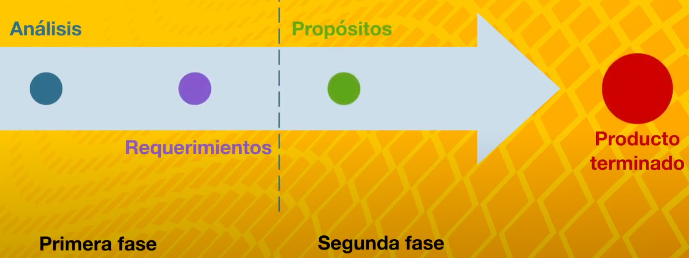

# Adquisición y análisis de requerimientos

Comprender el concepto de requerimientos de un *software* permite distinguir la importancia del proceso de construcción también conocido como adquisición de requerimientos, pues así sabrás en qué consiste cada una de las actividades del proceso en sí mismo.

## ¿Qué es el proceso de construcción y análisis de requerimientos?

Es posible comprender el proceso de construcción y análisis de requerimientos como el conjunto de técnicas y pasos a seguir que nos permiten conocer los elementos necesarios para definir un proyecto de *software*.

### Un análisis de requerimientos

Es la actividad de comprender las necesidades del usuario para resolver un problema utilizando una aplicación informática. El análisis de requerimiento está conformado por el proceso de construcción este consiste en una secuencia de pasos lógicos, es decir, actividades llevadas a cabo para diseñar, construir y probar una aplicación informática desde su planteamiento inicial hasta su implementación, habiendo identificado alternativas de solución.

Hacer un análisis de los requerimientos determinar lo que el *software* debe, hacer un requerimiento expresa el propósito del sistema sin considerar el *cómo*.

#### En esta primera fase

Únicamente se define la característica de funcionamiento, es decir, qué hace el sistema.

#### Segunda fase

Por otro lado en la etapa de diseño se establece el cómo lo hace.

En el presente diagrama se muestran las fases del proceso de construcción y análisis de requerimientos:

Adquirir el conocimiento para entender el proceso de requerimiento del *software* implica no solo ponerse en los zapatos del cliente sino también significa ser *empático* con las necesidades y expectativas.

## ¿Cómo llevar a cabo una evaluación de requerimientos de *software*?

Durante la construcción y análisis de los requerimientos es necesario llevar a cabo una evaluación que permita validar tanto los atributos del *software* construido como la funcionalidad obtenida de la aplicación informática. Una parte importante del ciclo de vida de los sistemas computacionales es:

### La validación

La validación del *software* es importante porque permite identificar errores asimismo es posible comprobar el cumplimiento de las especificaciones del sistema es decir que aquellas características de funcionalidad descritas al inicio se cumplan. Dependiendo del modelo de desarrollo que se utilice existen diferentes momentos en los que pueden llevarse a cabo una validación de manera general se recomienda realizar una validación cada vez que haya entregables el usuario.

### Herramientas para hacer una validación de *software* son

- Lista de comprobación de capacidades del *software*. Consiste en identificar aquellas funciones que debe realizar el programa informático llevando a cabo un contraste con las funciones del *software* planeadas y las funciones del *software* entregadas.
- hoja de prueba es un documento donde pueden identificarse los resultados que el sistema genera una vez que es sometido a pruebas de operación. Los resultados obtenidos son contrastados con aquellos datos que se espera obtener en búsqueda de errores
- hoja de prueba de componentes es un documento que permite valorar la inspección de cada componente que es diseñado. La inspección consiste en
Descubrir fallos en el código observar aquellos errores al momento de hacer pruebas individuales entre cada componente del *software*.

Las hojas de prueba contienen los datos que describen el sistema a continuación te mencionamos algunos de ellos.

### ¿Qué elementos pueden contener tanto hoja de prueba como una hora de prueba de componentes?

- ID. identificador único del caso de prueba.
- caso de prueba. Título que describe el caso de prueba.
- descripción. Indicar elementos es decir en qué consiste la prueba
- fecha. Fecha en la que fue elaborado el caso de prueba
- área funcional. Describe el área en donde se realizará la prueba el objetivo es identificar y poder dividir las pruebas complejas
- funcionalidad. Describe la función que se está aprobando.
- datos y acciones de entrada. Se especifican valores y datos de entrada así como acciones por ejemplo presionar un botón o ingresar comandos por vos.
- resultado esperado. Especificar la salida obtenida de la ejecución del caso de prueba.
- requerimiento de ambiente de prueba indicar especificaciones de hardware y *software* especial requerido.

## Verificación y validación de *software*

Dentro de la evaluación del *software* es importante distinguir el concepto de verificación y validación. La verificación y la validación no son lo mismo.

- la verificación permite comprender si el *software* está realizándose de acuerdo a las especificaciones.
- la validación permite asegurar que el *software* cumple con las expectativas.

Ambas la validación y la verificación son importantes porque permiten probar que el *software* hace lo que se espera que haga y de manera correcta.

### Pasos para la evaluación de requerimientos de *software*

A continuación se enlista la secuencia de pasos a seguir para llevar a cabo la evaluación de requerimientos de *software* en un análisis preliminar.

1. identificación de alternativas de solución.
2. selección previa de alternativas de solución.
3. definición de características a ser evaluadas.
4. evaluación técnica de las alternativas.
5. evaluación de características de funcionalidad de las alternativas seleccionadas.
6. selección de alternativas.

## Herramientas para el análisis de requerimientos

Existen varias herramientas que permiten recabar las necesidades del cliente para llevar a cabo el análisis de requerimientos.

### Diagramas de flujo

Aportan una visión global del proyecto de *software* los diagramas de flujo permiten crear modelos de datos como referencia logrando una aproximación orientada a objetos es decir representar el mundo real a través de diseños que pueden crear productos de *software* el propósito de los diagramas de flujo al momento de realizar una recolección de datos es precisamente contar con documentos de requerimientos que permitan comunicarlos a los participantes.

Encontraremos que en cada proyecto de desarrollo de *software* hay partes interesadas es decir personas que están involucradas en el proyecto y participan de forma activa para lograr el objetivo. Una práctica común en el análisis de requerimientos de *software* es construir diagramas de flujo de esta manera se pueden observar las secuencias de acciones así como detectar y tratar problemas de comunicación y comprensión del proyecto de *software* entre las personas involucradas en el proyecto.

El diagrama de flujo forma parte de los documentos de requerimientos deberá ser controlado y administrado, ya que contienen los requerimientos finales que se van a llevar a cabo en el proyecto.

### Documento de requerimientos

Es la herramienta útil para evaluar las actividades de diseño implementación, las pruebas realizadas y la verificación y validación de las actividades de requerimiento de *software*.
El documento de requerimiento puede estar conformado por diferentes elementos:

- diagramas
- manuales de operaciones
- listas de actividades
- fotografías
- entrevistas con las partes interesadas
- modelos o esquemas

Los diagramas de flujo junto con estructuras más complejas como diccionarios de datos o descripción de características de funcionamiento del *software* resultan herramientas útiles en términos de construcción de productos de *software* deberemos plantear si la descomposición del problema se logra a través del diagrama de flujo si esto es así el problema quedará más claro para su posterior solución un diagrama de flujo presenta ventajas y desventajas, por un lado, permite dividir la problemática en situaciones a grandes rasgos por el otro puede perderse el detalle de ciertas especificaciones.

## Ejercicios resueltos

1. Durante un levantamiento de requerimientos, ¿para qué sirve el proceso de adquisición y análisis de requerimientos?
   - Permite distinguir la importancia del proceso de construcción, pues ayuda a conocer en qué consiste cada una de las actividades del proceso en sí mismo.
2. ¿Cuál de las siguientes opciones corresponde a la secuencia de pasos para evaluación de requerimientos de *software* en un análisis preliminar?
    - Identificación de alternativas de solución
3. Un diagrama de flujo se puede considerar como una herramienta para la adquisición y análisis de requerimientos.
    - Verdadero.
4. Los diagramas de flujo permiten documentar todo el proceso y es una práctica común, de manera que no se pierde ningún detalle.
   - Falso.
5. Existen diferentes métodos para evaluar la alternativa de recuperar la información, los datos y necesidades que el cliente requiere en el producto de *software*.
   - Verdadero.
