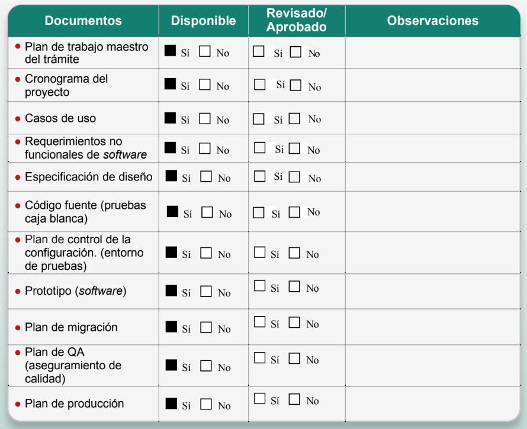
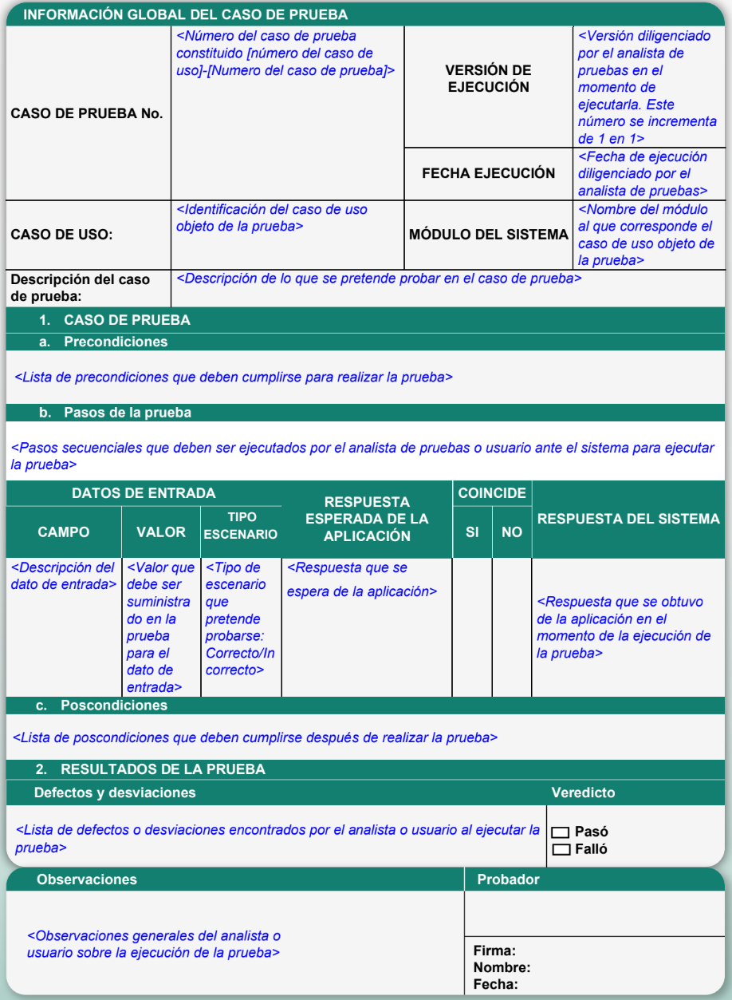

# Validación y administración de requerimientos

El requerimiento de *software* forma parte de los valores esenciales al momento de iniciar un proyecto; como ingenieros e ingenieras buscamos poner al frente de nuestra actividad profesional una trayectoria exitosa al alcanzar los objetivos de desarrollo de programas de computadoras.s

Por esta razón, deberá atenderse la importancia de dar validez y su lugar a los requerimientos que dan origen al proyecto de *software*. Existe una serie de recomendaciones al momento de administrar los requerimientos y su validación.

Importante

La validación de requerimientos otorga certeza al proyecto de *software*.

## Validación de requerimientos

Tiene como principal objetivo detectar defectos antes de iniciar un proyecto de desarrollo de *software*.

Administrar los requerimientos significa seguir etapas que permitan tener la completa seguridad de obtener un producto final y consistente.

La característica más importante de la **validación de requerimientos** es contar con evidencia documental que permita dar certeza de la detección del problema a resolver con un proyecto de *software*.

- El *software* debe cumplir con el **objetivo del proyecto**.
- Debe ser **validado cuando se documentan los objetivos del proyecto**. El usuario final podrá acceder a las funciones completas de *software* y comprobar que realmente se definió el sistema como fue pensado.
- Comprobar que los **requerimientos** del cliente son **funcionales** es un elemento fundamental para lograr el **éxito del proyecto**.

- Beneficios de contar con una validación y administración de los requerimientos:
  1. Confianza
  2. Ahorro de costo
  3. Seguridad en el funcionamiento
  4. Detección de errores
  5. Exactitud y consistencia del producto final

## Verificar que los requerimientos cumplen con las necesidades

5 beneficios de la validación y administración de los requerimientos:

- Confianza. El *software* podrá ser utilizado sin que se presente  una falla catastrófica o una falla menor que derive en un desastre.
- Ahorro de costos. La detección de un error a la mitad del proceso puede resultar costosa. La validación de requerimientos ayuda a identificar errores al inicio del proceso para evitar gastos innecesarios.
- Seguridad en el funcionamiento. El usuario podrá despreocuparse del producto de *software*, pues no presentará errores. El *software* que es constantemente verificado tiene una menor frecuencia de fallos, los cuales pueden generar un sobreprecio.
- Exactitud y consistencia. Un desarrollo de *software* tiene como fin un correcto funcionamiento. Incluso en condiciones adversas no planificadas, el *software* debe ser capaz de tener consistencia.
- Detección de errores. Permite detectar situaciones anómalas o posibles situaciones de falla al inicio del proceso de desarrollo.

## Técnicas de validación de requerimientos

Es importante validar lo que el usuario quiere que haga el sistema y lo que es viable, pues permite detectar errores incluso antes del análisis.

No realizar una validación previa puede incrementar los costos a tal grado que ponga en riesgo el proyecto en sí.

Una ingeniera y un ingeniero de *software* deben tener la capacidad de análisis de situaciones de riesgo, es decir, determinar lo que puede salir mal.

Hay diferentes técnicas de validación de requerimientos. Las principales pueden definirse de la siguiente manera:

- Revisiones.
- Diagramas de representación.
- Construcción de prototipos.

Considera los siguientes atributos al momento de diseñar un *software*:

Comparar lo deseado por parte del cliente o del usuario con lo que está siendo documentado en el proceso de **levantamiento de requerimientos**.

¿Qué es el proceso de levantamiento de requerimientos?

Es la acción de observar de forma manual cómo los participantes en el desarrollo del producto de *software*, interactúan para indicar lo que debe hacer el sistema informático y lo que realmente hará.

## Características de la validación y administración de requerimientos

- Revisión de requerimientos. Las partes interesadas en el proyecto verifican que el documento de requerimientos no presente fallas, omisiones o anomalías con respecto a lo que se pretende que haga el *software*.
- Diagramas de representación. Un diagrama de representación es una imagen que muestra el funcionamiento o descripción de aquello que se ha documentado previamente. Tiene la característica de ser un diagrama libre, en el cual es posible utilizar cualquier objeto gráfico para mostrar puntos de interés.
- Construcción de prototipos. Permite a los analistas de sistemas observar ejemplos funcionales previos, es decir, realizar pruebas antes de que el *software* se encuentre funcionando completamente.

Una forma de comprobar si estamos llevando a cabo la validación y administración de requerimientos correctamente es realizando la siguiente pregunta:

**¿El *software* realmente hace lo que me solicitaron?**

El requerimiento de *software* es muy importante, ya que debe ser posible revisar que el producto final satisface lo solicitado en un inicio y logra alcanzar el objetivo planteado en su totalidad.

Saber cómo asegurarnos de que cada requerimiento cumple con lo solicitado debe ser una de las tareas fundamentales en el proceso de verificación y administración de requerimientos.

Al momento de iniciar un proyecto de *software* se debe considerar realizar **pruebas de aceptación**.

### ¿Qué es una prueba de aceptación?

Una prueba de aceptación es un documento que permite convencer al cliente o al usuario con base en lo que se solicitó que el programa de computadora realice.

Diseñar pruebas de aceptación nos ayuda a validar que aquello que se está construyendo satisface al cliente.

#### ¿Cómo documentar pruebas de aceptación?

Con un archivo de documentos firmados o aceptados por el cliente que describan lo que el *software* hace. Se recomienda contar con evidencia de la prueba realizada.

## ¿Cómo funciona la validación y administración de requerimientos?

### Documentos de validación

Los documentos que permiten validar y administrar los requerimientos deben ser capaces de responder a la pregunta: **¿Puedo comprobar que lo que pidió el usuario o el cliente realmente funciona de forma correcta?**

Un **diagrama de flujo** puede expresar un **modelo de requerimiento**, es decir, puede funcionar como un prototipo para confirmar con el cliente o el usuario que aquello que está solicitando sea lo que se ha documentado.

### Administración de los recursos

Este proceso se reconoce como aquella actividad que permite organizar y llevar a cabo los requerimientos con el objetivo de mantener la consistencia con el sistema que se está construyendo.

Durante el desarrollo de *software*, administrar los requerimientos significa tener la posibilidad de controlar aquellos cambios de los requerimientos del sistema.  

Como parte de la administración de requerimientos se pueden considerar los siguientes pasos:

1. Identificar el problema.
2. Analizar si el problema tiene solución y el costo de analizar un cambio de *software*.
3. Determinar el costo.
4. ¿El costo supera los parámetros establecidos (incluido el tiempo)? Si la respuesta es positiva el cambio se rechaza, si es negativa, se podrá considerar el cambio en el proyecto de y llevarlo a cabo.

### Recuerda que

- La gestión de un cambio surge cuando se identifica la necesidad de resolver un problema.
- Se valora el efecto del cambio y se cuenta con un proceso para valorar si el cambio es factible.
- Al llevar a cabo la valoración, se decide si continuar o no con el cambio de requerimiento.
- Los cambios propuestos en el desarrollo de *software* deben ser congruentes y controlados.
- Utilizar un proceso formal para validar y administrar requerimientos hace la diferencia en un *software* de calidad.

---

A continuación se presenta un ejemplo de documento para que tengas en cuenta los elementos que se deben considerar y que resumen lo abordado en esta Lección.

A continuación, se presenta un ejemplo de documentación de validación que puede ser aplicado para verificar que los requerimientos cumplan con las necesidades del cliente.

### Formato de lista de chequeo de prerrequisitos

### Formato de casos de pruebas funcionales

## Ejercicios resuletos

1. ¿Cuál es la principal característica de la validación de requerimientos?
    - Contar con evidencia documental que permita dar certeza de la detección del problema a resolver a través de un proyecto de *software*.
2. Administrar los requerimientos significa:
    - Seguir etapas que permitan tener completa seguridad de obtener un producto final y consistente.
3. El *software* deberá ser validado cuando se documentan los objetivos del proyecto.
    - Verdadero
4. Algunos de los beneficios de contar con una validación y administración de los requerimientos es ahorrar en el número de personas que se involucran en el proyecto de *software*.
    - Falso
5. Ejemplo de técnicas de validación de requerimientos: Revisiones, diagramas de representación y construcción de prototipos.
    - Verdadero
