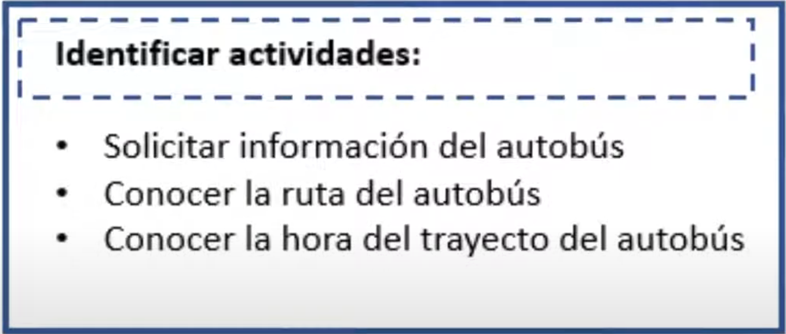
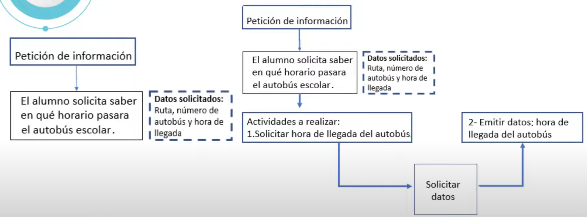
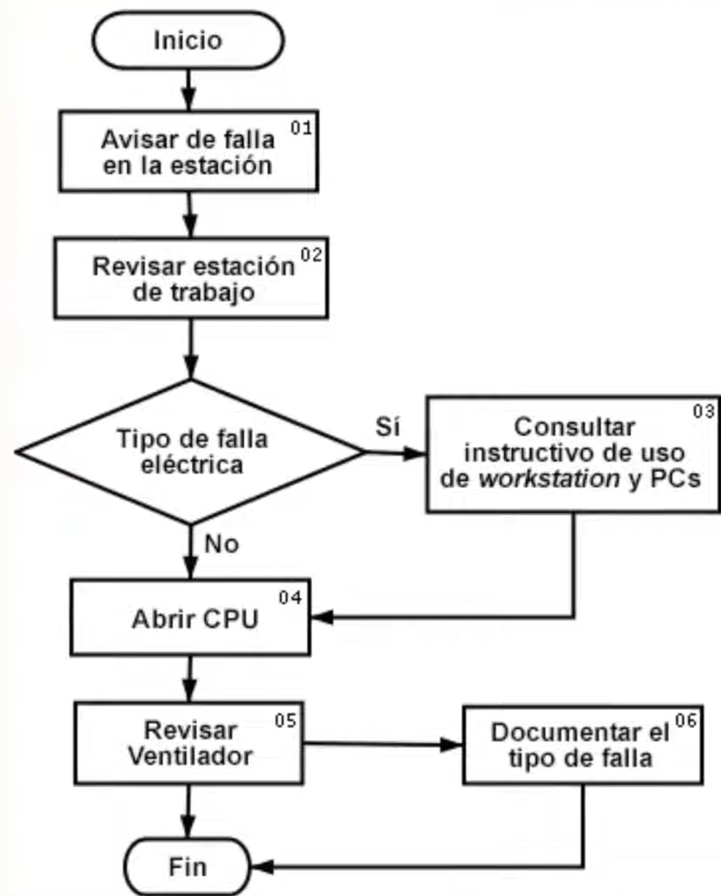
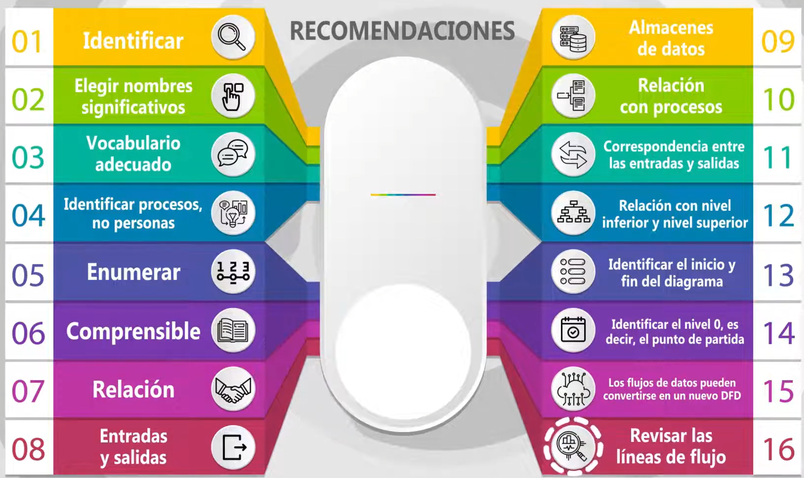

# Flujo de datos en el diseño arquitectónico

¿Qué es un diagrama de flujo de datos?

El diagrama de flujo de datos o DFD es una herramienta gráfica que permite identificar qué camino siguen los datos en un programa de computadora.

Con un diagrama flujo de datos, es posible observar el camino que siguen los datos a través de diferentes orígenes.

**Por ejemplo**, un documento de registro de entrada y salidas de mercancías tiene su origen en las ventas y compras registradas.

## ¿Cuál es la utilidad de un diagrama de flujo de datos?

- El diagrama de flujo de datos permite identificar entre otras cosas el **almacenamiento de datos**.

- Además, permite definir la **forma en la que se transportan los datos** mediante las entradas y salidas al sistema.

- Después de abordar el concepto y la utilidad de los diagramas de flujo de datos, es momento de revisar a detalle **los componentes y elementos que los caracteriza**.
- **Las funciones** que tiene como construirlos.
- y algunas **recomendaciones para hacerlos/diseñarlos**.

## ¿Qué componentes conforman un diagrama de flujo?

Un diagrama de flujo se compone de diferentes **grafos** o **dibujos**.

- De manera general observamos la figura geométrica de un óvalo que permite representar el inicio o fin de un proceso.

- La figura de un rombo permite señalar decisiones.

- Un rectángulo determina acciones o actividades.

## ¿Qué elementos componen un DFD?

Un DFD está compuesto por:

- entidades externas.
- entidades internas.
- Procesos.

### Entidades externas

Son aquellas fuentes de información ajenas al sistema informático.

**Por ejemplo**, datos de una empresa diferente o negocio fuera de la organización, pero que interactúan con ella.

Otras entidades externas pueden ser

- personas,
- departamentos,
- fuentes de consulta,
- clientes,
- sensores o cualquier recurso que emita datos y que son utilizados por el sistema.

#### La característica de las entidades externas

Es que los datos son modificables por el diseñador del sistema, pero la entidad externa, por ejemplo, el registro de huella de un reloj biométrico proporciona los datos al sistema.

Normalmente, estos datos no son modificables por el ingeniero de *software*, sino que debe trabajar con ellos y pueden formar parte del sistema posteriormente.

Mediante la designación de alguna entidad externa, el sistema establece que recibirá datos que están fuera de sus límites, considerando la posición de transformación de los datos para el funcionamiento del sistema, entidades internas.

### Las entidades internas

Son aquellas que forman parte del mismo sistema, el desarrollado del *software* si pueden influir sobre ellas.

Por ejemplo, personas que están dentro de la organización que aportan datos al sistema que se está diseñando.

### Proceso

El tercer elemento que conforma un diagrama de flujo de datos es el proceso.

**Proceso**, la función de un proceso en un diagrama de flujo de datos es identificar cómo se transmiten las entradas de datos en salidas de información.

Por ejemplo, al recibir un archivo por correo electrónico, se debe saber cuál es la ruta que sigue.

Físicamente, un proceso puede ser un área de trabajo con personas realizando actividades que, solas o combinadas, generan intercambio de información.

Como resultado de las actividades, también pueden producirse manuales, diagramas o cualquier otro elemento que permite reconocer el flujo de actividades y el flujo de información.

## ¿Cómo construir un diagrama de flujo de datos?

En el siguiente ejemplo, realizaremos un diagrama de flujo de datos.

- Paso número uno. Identificar el alcance del grupo de actividades que serán observadas dentro del sistema, es decir, hasta qué punto abarca el *software* a ser construido.

- Paso número dos. Definir el nombre de las actividades del proyecto que serán transformadas en un programa informático.

- Paso número tres. Realizar el diagrama de flujo de datos.

### Veamos un ejemplo

Haremos el diseño de un programa informático, una aplicación para dispositivos móviles que permita a los estudiantes universitarios, conocer información respecto al transporte público exclusivo para estudiantes.

El **paso número uno** es definir hasta dónde abarca el *software*.
En este caso, la definición de alcance es que los estudiantes conozcan las rutas y horarios de trayecto de los autobuses exclusivos para alumnos.

**Paso número dos**.
Definir el nombre de las actividades del proyecto que serán transformadas en un programa informático.

Los alumnos necesitan conocer el horario en el que pasará el autobús.
Lo que se define las actividades.

- Uno. Solicitar hora de llegada.
- Dos. Recibir datos del autobús escolar. Incluida la hora de llegada, la ruta y el número de autobús.

Podemos observar en el siguiente diagrama cómo colocamos las actividades que generan datos.

**Paso número tres**.
Realizar el diagrama de flujo de datos.
Recordemos que el diagrama de flujo de datos representa el trayecto de solicitud de datos al sistema y su respectiva respuesta.

El objetivo del diagrama es lograr la mayor claridad posible de los datos que utilizaremos en la aplicación informática que estamos diseñando.

Se recomienda utilizar verbos en infinitivo para describir las actividades que serán registradas en el diagrama.

---
En resumen, el diagrama de flujo de datos **es la descripción de cómo los datos viajan entre las entidades por medios de documentos o información, la cual va a ser tratada o modificada por el sistema**.

Se puede representar este viaje de los datos mediante líneas de seguimiento dentro del mismo diagrama, apoyándose por notas al margen e indicando cuáles son entradas y cuáles son salidas de datos.

La dirección de los datos en el flujo respectivo viene indicada por medio de la punta de la flecha que se utilicen el diagrama.

### Recommendaciones al momento de construir un diagrama de flujo de datos

Se recomienda **tener una descripción del contenido de los datos**, pues será de gran utilidad para describir lo que sucede en el flujo correspondiente.

El flujo de datos puede estar presente en cualquier contenido físico.

Por ejemplo

- notas en papel.
- archivos impresos.
- archivos digitales.

Cualquiera entidad que esté involucrada en el flujo de datos deberá quedar representada en el diagrama.

### ¿Cómo debe ser un diagrama de flujo de datos?

Un DFD debe ser

- fácil de explicar.
- identificable en sus componentes básicos.
- podrá dibujarse en una computadora.

## ¿Qué es el mapeo de diagrama de flujo de datos?

El mapeo de un diagrama de flujo de datos es dibujar, en computadora o a mano, el trayecto que siguen los datos en un sistema informático.

Existe una serie de recomendaciones para realizar el mapeo de un diagrama de flujo de datos.

1. Identificar las entidades externas, lo cual permitirá definir los límites del sistema.
2. Se recomienda elegir nombre significativos para los procesos.
Asimismo, colocar nombre significativos para los flujos de datos, tanto de almacén de datos como entidades externas.
3. Utilizar un vocabulario adecuado de manera que sea accesible para el usuario, evitar terminología técnica cuando sea posible.
4. El diagrama deberá identificar el proceso, no las personas que lo realizan.
5. Enumeran los procesos que deban estar en el diagrama, para que pueda entenderse la secuencia, puedes utilizar una secuencia de ejecución numerada.
6. El diagrama debe ser fácil de leer, evita la complejidad, los diagramas DFD deberán ser comprensibles, digeribles y agradables a la vista.
7. Todos los elementos deben tener una relación.
8. Los procesos deben tener entradas y salidas claramente especificadas.
9. Los almacenes de datos se relacionan solo con procesos.
10. Las entidades externas se relacionarán únicamente con procesos.
11. En los niveles DFD, deberá haber igual número de entradas y salidas.
12. Cada proceso que se detalle en el DFD, a de estar balanceado, es decir, cada proceso en el nivel inferior deberá estar relacionado con el proceso del nivel superior. En este sentido, se entiende que el balanceo en que cada proceso debe tener exactamente los mismos datos de entrada y salida, que el DFD inferior,
13. Seleccionar el nivel de inicio, es decir, el DFD deberá especificar las entradas y salidas de datos y desde donde se realiza el seguimiento de los datos.
14. Identificar el nivel 0, esto significa tener un punto de partida, así como niveles de entrada y salida a nivel donde cada proceso inicie.
15. Cada proceso en un DFD de alto nivel en un sistema puede ser utilizado para convertirse en un DFD en sí mismos. Los flujos de datos pueden convertirse en un nuevo DFD,
16. Revisar las líneas de flujo para evitar el cruzamiento de las líneas de flujo, pues es posible tener una línea más de una vez en el mismo diagrama, siempre que esté correctamente documentada.

### Recomendación final

Como recomendación final, es conveniente dibujar el DFD tantas veces como sea necesario, de manera que sea técnicamente correcto, aceptable para el usuario y lo suficientemente claro para ser entendido por las partes interesadas dentro del proyecto de *software*.

## Ejercicios Resueltos

1. En ingeniería de *software*, ¿qué es un diagrama de flujo de datos?
    - Es el empleo de datos para llevar a cabo el proceso de análisis de un sistema informático.
2. De las siguientes opciones elige la que corresponde al elemento del DFD que se caracteriza porque los datos no son modificables pero proporcionan o usan los datos del sistema:
    - Entidades externas.
3. El almacenamiento de datos depende de bases de datos, que a su vez siguen un sentido de la información, es decir, un flujo.
    - Verdadero.
4. Para construir un diagrama de flujo de datos, deberá estimarse el alcance del proceso que se va a medir.
    - Verdadero.
5. El DFD representa un transporte de paquetes de datos desde su origen hasta su destino.
    - Verdadero.
